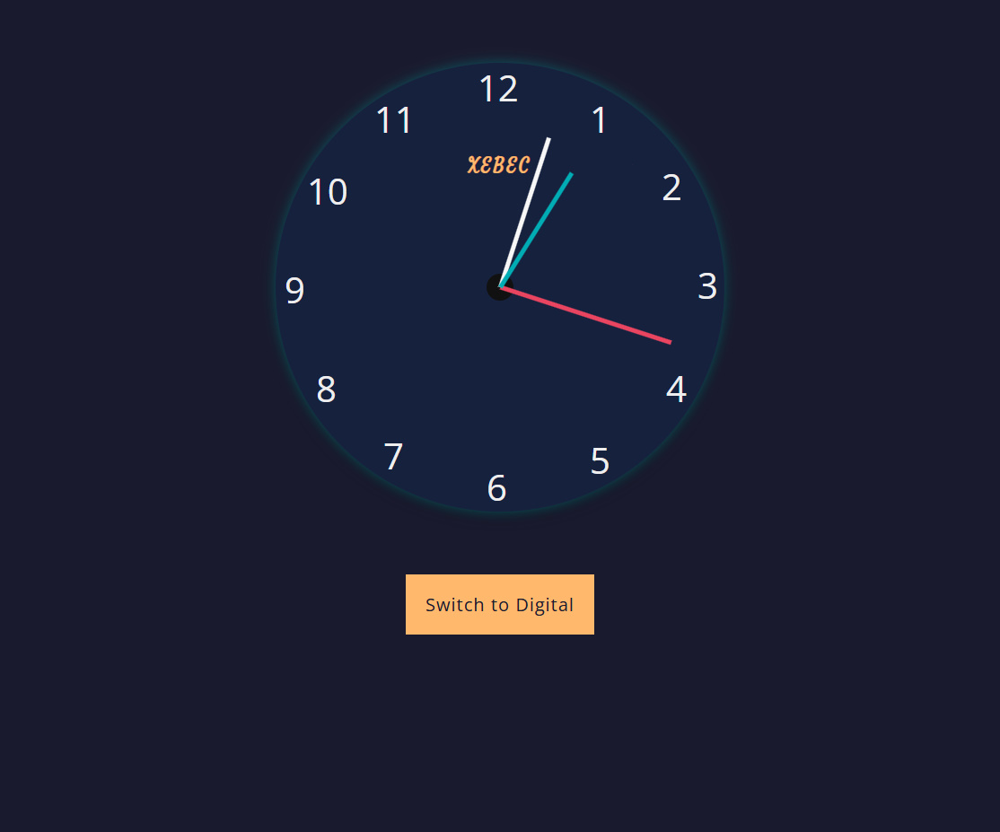
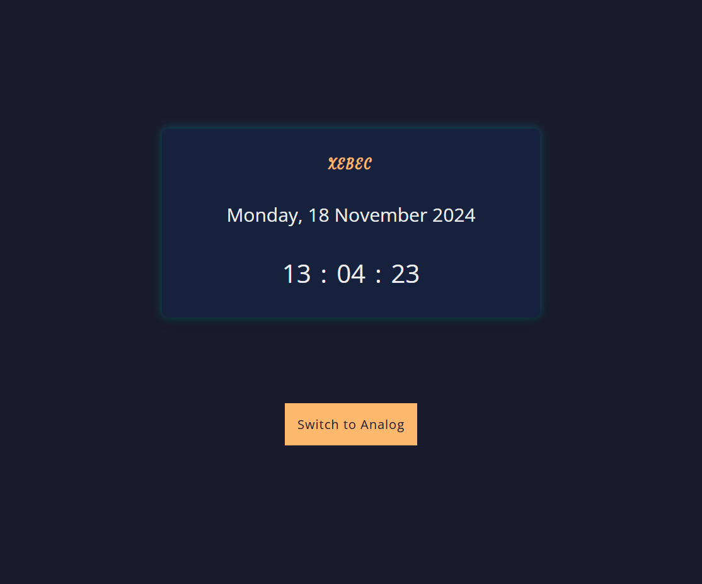

# JS Clock
Clock in HTML, CSS and JavaScript.
Can switch between Analog and Digital formats. 

## Preview 
### Analog Clock 

### Digital Clock 

## Colors
### Dark Mode Colors 
1. bg-color-da: #1A1A2E;
2. clock-face-color-da: #16213E;
3. text-color-da: #EEEEEE;
4. brand-color-da: #FFB86C;
5. btn-bg-color-da: #FFB86C;
6. btn-text-color-da: #1A1A2E;
7. btn-hover-color-da: #FF9B4A; 
8. second-color-da: #E94560;
9. minute-color-da: #F7F7F7;
10. hour-color-da: #00ADB5;
11. box-shadow: 0 0 15px rgba(0, 255, 255, 0.3), 0 5px 20px rgba(0, 0, 0, 0.5); 

### Light Mode Colors 

## Fonts 
1. OpenSans
2. Satisfy 